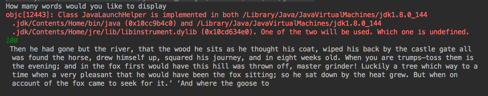

# AIStarterProj
all files and their purpose/contents

- gitignore
    - ensures that the machine specific files are not pushed to git resulting in version control errors
- proj1
    - this is the bulk of this project. It will sort through the given training text and produce sentences based on that style. It will "learn" to use similar punctation and vocabulary by storing and choosing from dictionaries of the training text. 
- traningtext
    - currently containing an exerpt of moby dick, this text is the basis for proj1 to learn from. This text can be altered to change the style of the work one wishes for the program to produce. 
    
*    Here is a photo of a sucessful run 
    

instructions on how to run the project: any setup/libraries, and instructions on how to run the code with screenshots of what it should look like when it runs.

This project was created and can be easily run using intelleJ
for infomation on how to download and run intelleJ
the community version is availible here: https://www.jetbrains.com/help/idea/installation-guide.html
reference this video if you need help:
https://www.youtube.com/watch?v=upQu_brz7OI

after intelleJ software is intalled
- clone the github repository
- after opening the files insure that the module is marked as active and that an output path is established
- to do so open project structure and mark the path to the out folder and your machine then apply changes

* to run the system just press the run button on the proj1 file
* If you wish to change the style of the sentences. Just delete the text out of training text and input a new text in your desired style

